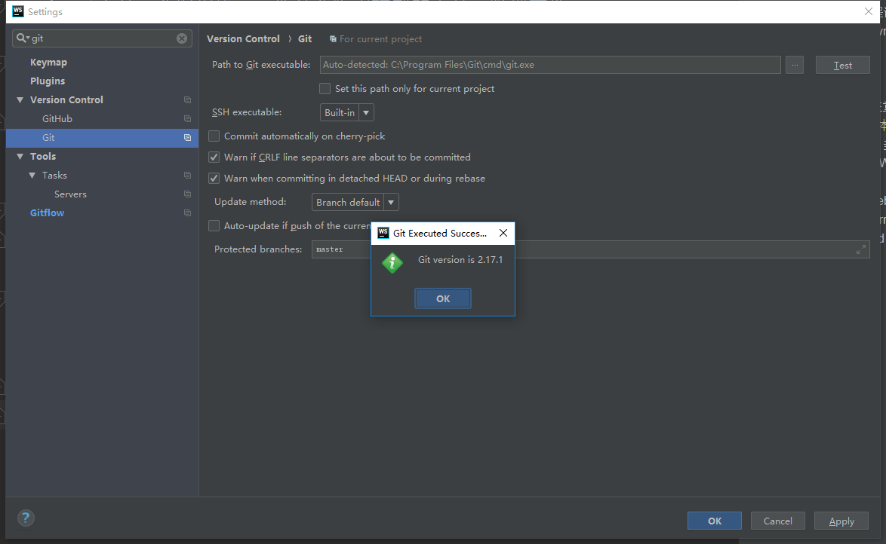

# git

0. 下载
 * [下载地址](https://git-scm.com/downloads)
1. 介绍
    * git不是一个编程语言，他是个版本控制的工具，管理文件
    * 版本控制工具svn，这2者的区别简单提下
        * svn 集中式
        * git 分布式
        * [总结好文](https://www.cnblogs.com/leeyongbard/p/9777498.html)
2. 最好自己在本地建立个本地仓库，然后把简单的指令练起来        
3. 为什么新手不用太注重git指令(简单指令还是需要了解的)，因为现在有很多智能IDE还有Source Tree
4. svn转git的时候，基本新手都是用界面操作的
5. 当然深入也是好的，多学习git指令，在界面操作的时候可以脑补下，
    这里原理使用的什么命令    
6. 这边我使用的IDE是WebStorm,JetBrains的产品，不同的编程语言选择不同的产品
    * java - Idea
    * css/html/js - WebStorm
    * python - Pycharm
    * golang - Goland
7. 下好IDE以后,setting配置git安装路径，可以点击测试查看
    * File -> settings -> 搜索git
    
    
8. 项目右键git，之后可以可视化操作，对应的执行自行学习
    比如 git commit相当于**Ctrl+K**+写提交信息+点击按钮
    **Ctrl+Shift+K**提交到远端
    
      
