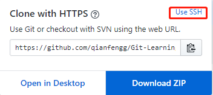
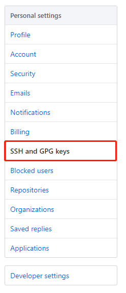

# github
1. github是什么
    * 简单粗暴的理解 使用git命令，将自己项目托管到远端的资源管理库(版本库)
    * 还有个gitlab，和这个类似，主要公司里用
    * 同样是前面的链接参考
        * [总结好文](https://www.cnblogs.com/leeyongbard/p/9777498.html)
        * GitHub 和  GitLab 都是基于 web 的 Git 仓库，使用起来二者差不多，
            它们都提供了分享开源项目的平台
        * 从代码的私有性上来看，
            GitLab 是一个更好的选择。但是对于开源项目而言，GitHub 依然是代码托管的首选。
        
2. github上创建自己的项目
    1. 首先注册账号密码这边不在赘述
    2. 点击上方tab的**Repositories**,这个中文就是项目复数   
    3. 点击new
    
    
    
    4. 输入新建项目的一些参数属性
    
    
    
    5. 输入项目名称，项目描述，是否需要初始化md文件
    6. 创建完了以后，git clone到自己本地
    7. 本地库和远端库如何连接?    
        * File -> settings -> 搜索github
        * 点击Create API Token，输入自己的github账号和密码
        * 点击test
        
        * 这样界面操作就可以将自己本地项目和远端项目连起来
    8. 然后你就能提交到远端
    9. 原理是git remote add origin XXX.git 
    10. 然后就尝试提交推送远端，开始玩你第一个github的项目吧！！

3. 删除项目
    * 点击进入自己的项目
    * 点击上方的Tab**Settings**    
    * 滚动条拖到最下面，点击Delete this repository 
    * 根据提示操作就可以删除了
 
4. 在远端直接修改
    * 就是直接点编辑
    * 不要忘记远端改好，本地记得同步更新哟，快捷键是(**Ctrl+T**)
    * 举个例子
      1. 我在家里修改了什么文件，增加了什么代码提交到远端github
      2. 然后第二天去了公司，忙里偷闲，(假设公司已经把项目clone了，那本地的代码就不是最新的了)，
        然后更新代码从远端啦，这样就能保证本地的代码和远端一致
      3. 同理，公司电脑改了东西推送到远端，回家后同样的操作
      4. 只要有远端库，github自己账号知道，然后多台电脑可以同步工作，只要记得更新代码
    
5. 平时用github做什么
    * git clone 看别人项目
    * 自己写的项目练习可以提交
    * 记录自己学习的过程
    * 看大佬出的题目，参与做题
    * 参与大佬的开源项目
        * 先fork
        * 在clone
        * 在参与改代码
        * 在PR,向作者申请看下自己提交的代码
        * 在等作者MR，作者决定要不要把你的代码合并到自己的项目里
        
6. ssh配置
    * 使用SSH可以使我们push和pull相对HTTPS快，理论是这样~
    * 配置SSH就可以不用每次输入账号密码
    * 首先我们来看下github默认Clone or download使用的是Use HTTPS,然后我们可以看到右上角可以点击Use SSH
    
         
        
    * 所以先来一波ssh的知识，参考[这篇文章](https://git-scm.com/book/zh/v2/%E6%9C%8D%E5%8A%A1%E5%99%A8%E4%B8%8A%E7%9A%84-Git-%E7%94%9F%E6%88%90-SSH-%E5%85%AC%E9%92%A5)
        1. 生成ssh - `ssh-keygen -t rsa -C "youremail@example.com"`
        2. 查看 - `cat ~/.ssh/id_rsa.pub`
        3. 也可以通过**C:\Users\用户名\.ssh**文件下，找到id_rsa.pub,用编辑器打开，然后复制
    * 在到github上配置
    
        
        
    * 然后在看下[这篇文章](https://blog.csdn.net/JNingWei/article/details/78756244) 
        1. 先看下远端用的是HTTPS还是SSH - `git remote -v`
        2. 如果是HTTPS就删除 - `git remote rm origin`
        3. 使用第一步的指令，可以看下是否删除
        4. 添加新的远端 - `git remote add origin git@github.com:xxx/xxxxxx.git`
        5. 在使用第一步看下添加SSH是否成功
   
* [目录](./00-git知识分享.md)        
    
    
            