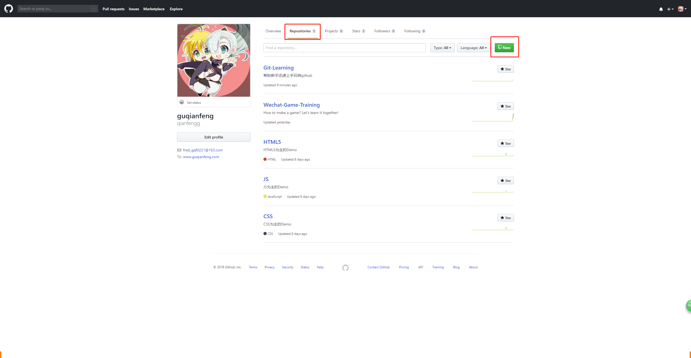
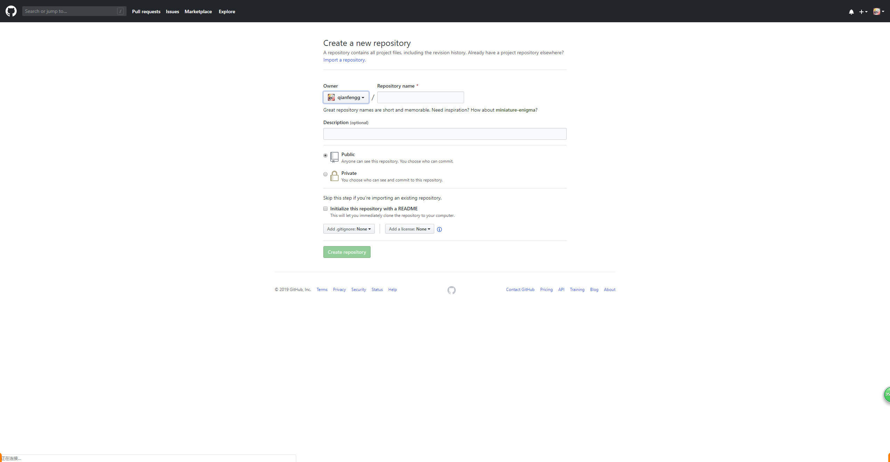
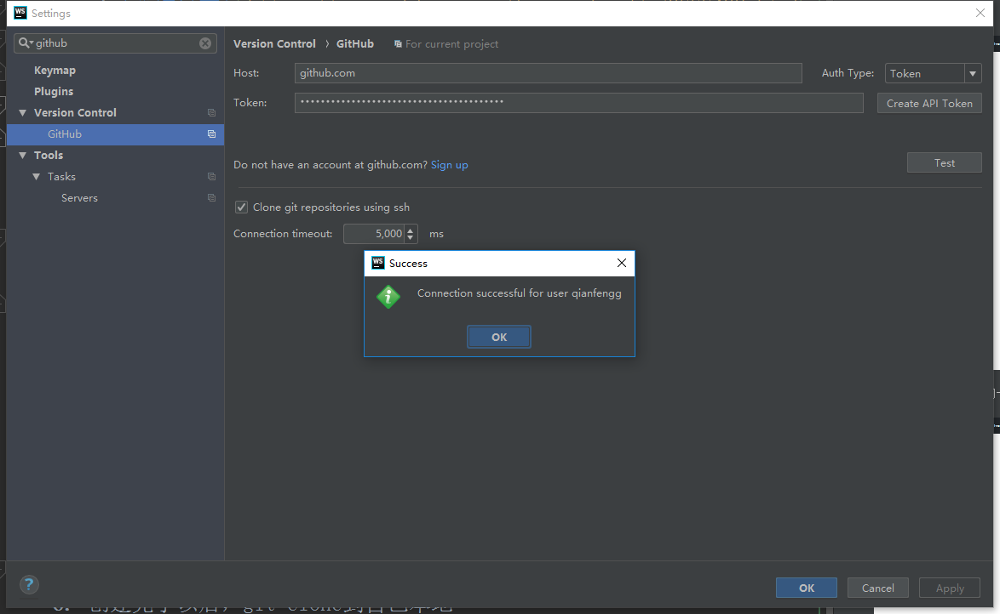

# github
1. github是什么
    * 简单粗暴的理解 使用git命令，将自己项目托管到远端的资源管理库(版本库)
    * 还有个gitlab，和这个类似，主要公司里用
    * 同样是前面的链接参考
        * [总结好文](https://www.cnblogs.com/leeyongbard/p/9777498.html)
        * GitHub 和  GitLab 都是基于 web 的 Git 仓库，使用起来二者差不多，
            它们都提供了分享开源项目的平台
        * 从代码的私有性上来看，
            GitLab 是一个更好的选择。但是对于开源项目而言，GitHub 依然是代码托管的首选。
        
2. github上创建自己的项目
    1. 首先注册账号密码这边不在赘述
    2. 点击上方tab的**Repositories**,这个中文就是项目复数   
    3. 点击new
    
    
    
    4. 输入新建项目的一些参数属性
    
    
    
    5. 输入项目名称，项目描述，是否需要初始化md文件
    6. 创建完了以后，git clone到自己本地
    7. 本地库和远端库如何连接?    
        * File -> settings -> 搜索github
        * 点击Create API Token，输入自己的github账号和密码
        * 点击test
        
        * 这样界面操作就可以将自己本地项目和远端项目连起来
    8. 然后你就能提交到远端
    9. 原理是git remote add origin XXX.git 
    10. 然后就尝试提交推送远端，开始玩你第一个github的项目吧！！

3. 删除项目
    * 点击进入自己的项目
    * 点击上方的Tab**Settings**    
    * 滚动条拖到最下面，点击Delete this repository 
    * 根据提示操作就可以删除了
 
4. 在远端直接修改
    * 就是直接点编辑
    * 不要忘记远端改好，本地记得同步更新哟 
    
5. 平时用github做什么
    * git clone 看别人项目
    * 自己写的项目练习可以提交
    * 记录自己学习的过程
    * 看大佬出的题目，参与做题
 
   
    
    
    
            