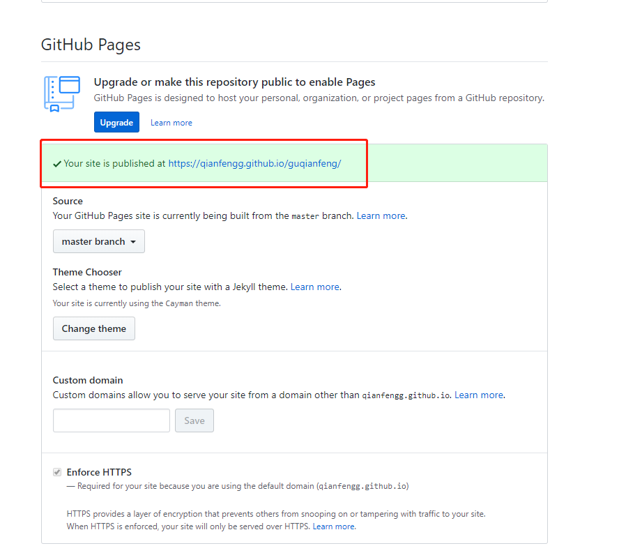
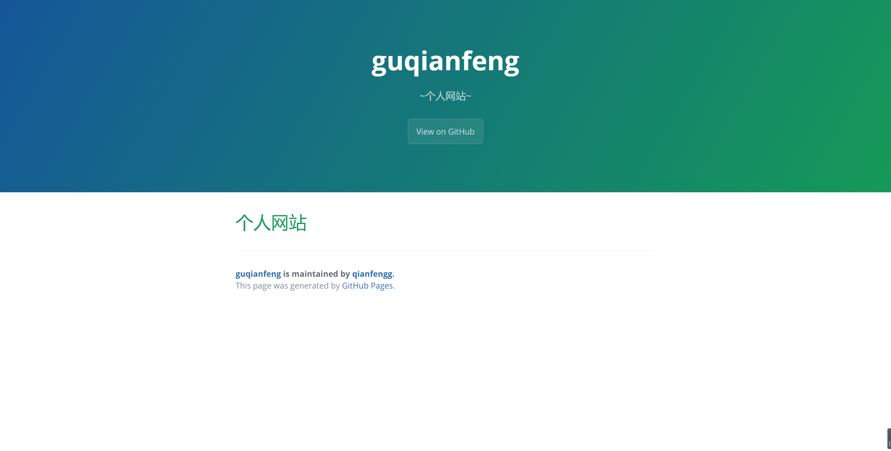
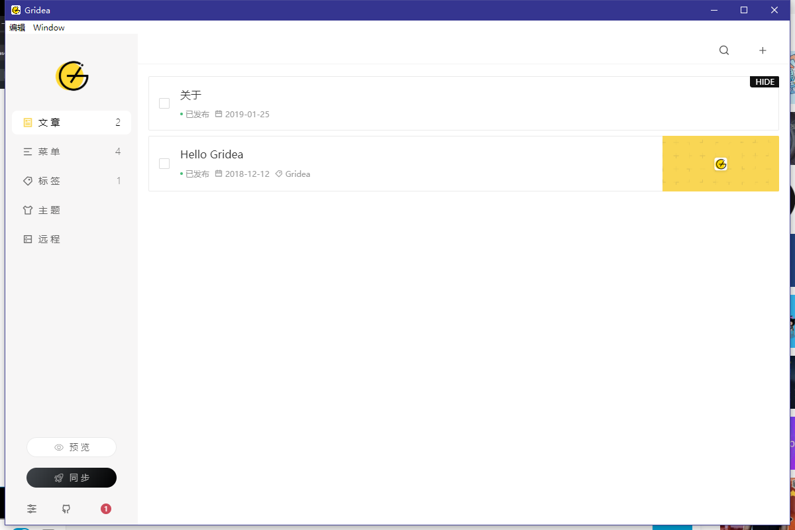
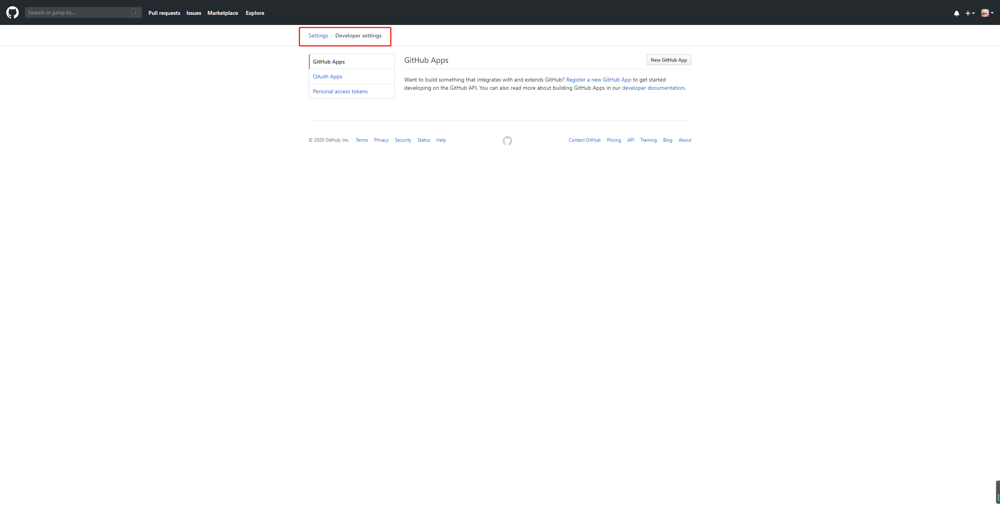
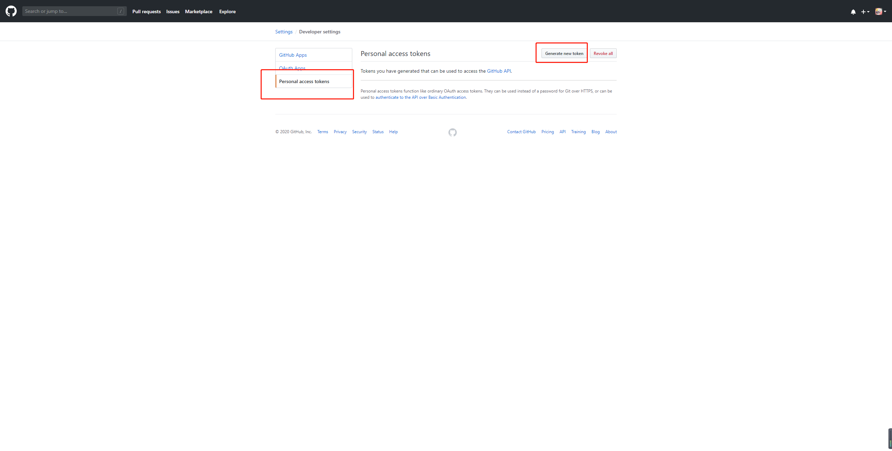
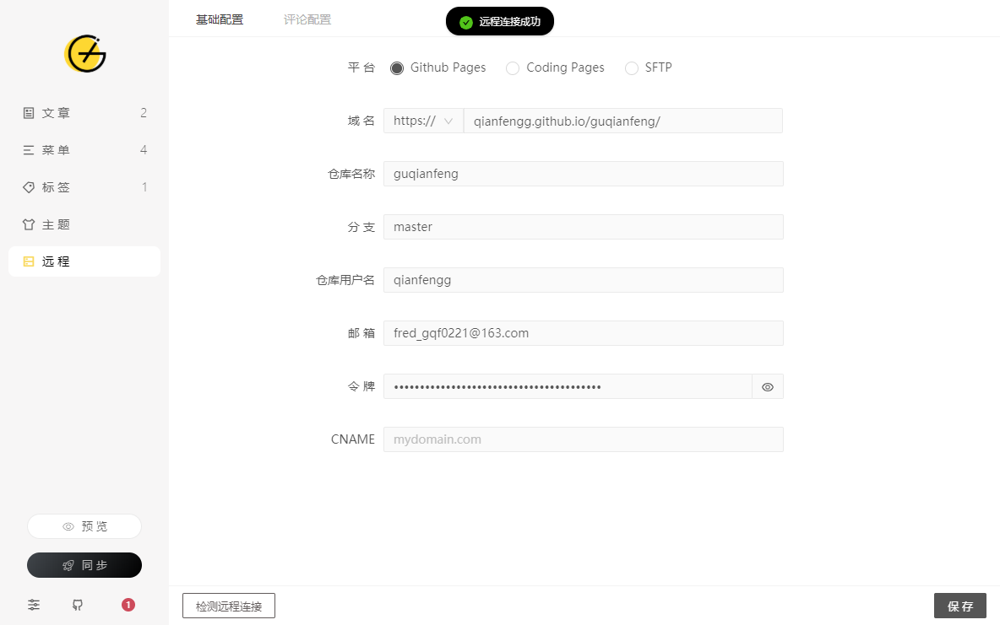
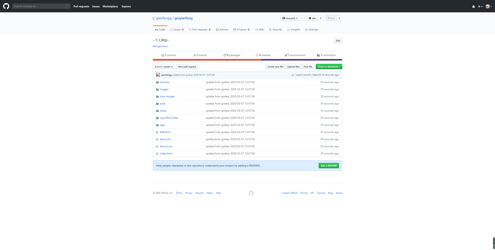

# 04-github迅速搭建自己的网站

> 搭建流程

* 先注册github账号这个没任何可以说的
* 点击右侧加号创建新的仓库`Create a new repository`
* 记得输入仓库名，名字可以任意起
* 还需要初始化README，至于描述可以加也可以不加也可以在后续加
* 创建完以后进入自己的仓库
* 点击右上角有个Settings，往下拉，看到个选项Github Pages，然后点击选择主题    
* 选择自己喜欢的模板后，点击确认模板**Select theme**
* 然后就能看到网址,接着就可以访问拉

    

* 访问效果如下

    

* [下载Gridea](https://gridea.dev/#started)    

* 打开Gridea，界面是这样的

    

* 接着点开我们github个人的设置(右上角点击头像，然后点击Settings)   

* 点击开发人员设置**Developer settings**

    

* 点击个人访问令牌，然后点击生成令牌 

    

* 后面的页面，需要把所有的都勾选上，开发者可以在控制台，然后点击生成令牌
    ```
    $$("[type=checkbox]").forEach(item => item.checked = true)
    ```    

* 生成后记得把那串像密码一样的保存起来~
* 回到Gridea软件，点击远程，然后进行设置，记得最后可以测试远程连接

    

* 之后就点击保存，在点击左下方的同步，此时再回到我们仓库就可以看到多了些文件

    

* 接下去就是大家去[Gridea](https://gridea.dev/) 学习，创造自己的网站吧~  

* 全速访问github
    * 找到hosts目录**C:\Windows\System32\drivers\etc** 
    * 把下面的东西复制到hosts文件
        ```
        # Github
        192.30.253.113 github.com
        151.101.185.194 github.global.ssl.fastly.net
        203.98.7.65 gist.github.com
        13.229.189.0 codeload.github.com
        185.199.109.153 desktop.github.com 
        185.199.108.153 guides.github.com 
        185.199.108.153 blog.github.com
        18.204.240.114 status.github.com
        185.199.108.153 developer.github.com
        185.199.108.153 services.github.com
        192.30.253.175 enterprise.github.com 
        34.195.49.195 education.github.com 
        185.199.108.153 pages.github.com 
        34.196.237.103 classroom.github.com        
        ```
    * 之后Win + R，cmd后，输入这条指令`ipconfig /flushdns`    